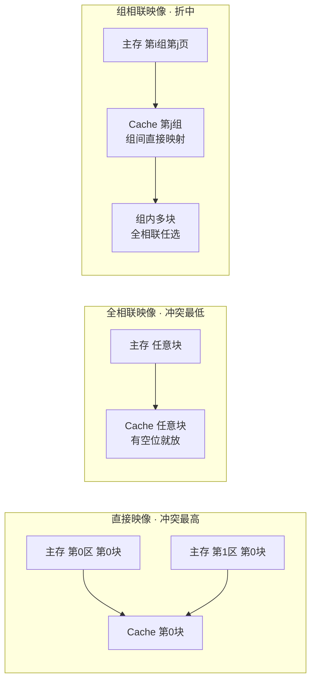

# Cache 高速缓存

## 定位

位于 CPU 与主存之间的小容量高速缓冲存储器（SRAM，速度约为内存 5~10 倍），存主存最常用数据的**拷贝**。CPU 先访问 Cache：命中则直接取；未命中才访问主存。

特性：**CPU 私有、对程序员透明**（程序员感知不到 Cache 存在，地址映像由硬件完成）。

> ⚠️ **考点**：Cache 与主存之间的地址映像由**硬件自动完成**——不是操作系统、不是程序员、不是软件。历年反复考。

## 地址映像（把主存地址映射为 Cache 地址）

| 方式 | 规则 | 冲突率 | 硬件复杂度 |
|------|------|--------|-----------|
| 直接映像 | 主存、Cache 都分块；**块号相同才能命中**（区号任意） | 最高 | 简单 |
| 全相联映像 | 主存任意块可放 Cache 任意块（有空位就放） | 最低 | 复杂 |
| 组相联映像 | 先分块再分组；**组间直接映像（组号相同）+ 组内全相联** | 折中 | 折中 |

冲突 = 想调入的位置已被占用。真题：冲突概率 **直接 > 组相联 > 全相联**。

> 图：三种地址映像方式（mermaid 补画，课件无此配图）

### 组相联计算例题（真题级别）

> Cache 总容量 64 块、每块 128 字、每 4 块一组；主存 4096 页。

- **规定 1**：主存页大小 = Cache 块大小（128 字）
- **规定 2**：主存每组的页数 = Cache 的组数
- Cache：64 块 ÷ 4 块/组 = **16 组**（组号 4 位 = 2⁴）
- 主存：每组 16 页 → 4096 ÷ 16 = **256 组**；总容量 = 4096 × 128 = 2¹⁹ 字 → **地址 19 位**
- 映射：主存第 i 组第 j 页 → Cache 第 j 组（组内 4 块任选）

## 替换算法（Cache 满时淘汰不常用的块）

| 算法 | 策略 | 说明 |
|------|------|------|
| 随机替换 | 随机选块淘汰 | 无原理 |
| FIFO | 最先进入的块淘汰 | 先进先出 |
| **LRU** 近期最少使用 | 淘汰最近最少使用的块 | **最常用**，依据局部性原理 |
| 优化替换 OPT | 先试运行统计替换情况 | 理论最优，不可实现 |

> ⚠️ 材料差异：课件列 FIFO/LRU/**LFU**/OPT，视频讲随机/FIFO/LRU/OPT。复习以真题出现者为准，LRU 必考。

## 写策略（Cache 与主存一致性，三种方法）

| 策略 | 做法 | 特点 |
|------|------|------|
| **写直达**（全写法） | 写 Cache 同时写主存 | 完全同步、一致性好 |
| **写回** | 只写 Cache，块被**淘汰时**才写回主存 | 有滞后性，速度快 |
| **标记法** | 每块设**有效位**：调入置 1，CPU 修改时写主存并置 0 | 读时判断：有效位 1 从 Cache 读、0 从主存读 |

## 命中率与平均访问时间（计算题必考）

$$\text{平均访问时间} = H \times T_{Cache} + (1-H) \times T_{内存}$$

**真题**：90% 命中 Cache（1ns）、未命中读内存（1000ns）→ 平均 = 0.9×1 + 0.1×1000 = **100.9ns**。

> 老师提示：理论上未命中时其实也先访问了 Cache（应再加一次 Cache 时间），但**考试按上述简化算法**，不要纠结。

命中率曲线：Cache 容量越大命中率越高，但到一定容量后**增速放缓**（像 50 分提高到 70 分比 10 分提高到 50 分难）。

## 常见坑

- 地址映像由**硬件**完成（非 OS/程序员）——送分题
- 全相联不浪费空间、几乎无冲突；直接映像冲突最高
- 组相联计算抓住两条规定：页大小=块大小、主存每组页数=Cache 组数

## 相关页面

- 上级：[[wiki/concepts/存储系统]]
- 相关：[[wiki/concepts/磁盘存储]]（替换算法同源）
- 原理：[[wiki/concepts/局部性原理]]（LRU 与调入策略的依据）
- 来源：[[wiki/sources/1.2存储系统]] · [[wiki/sources/课件总结-第一章]]
