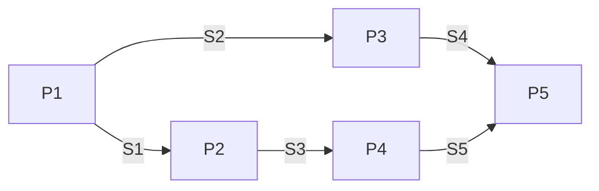

# PV 操作与信号量

> **必考**：同步和互斥是每年的考点，一考就是 3 分；操作系统选择题总共约 6 分，PV 占一半。

## 基本概念

| 概念 | 含义 | 例 |
|------|------|-----|
| 临界资源 | 同一时间仅允许一个进程访问的资源（互斥访问） | 打印机 |
| 临界区 | 进程中**操作临界资源的代码片段**（是代码，不是资源） | 打印代码段 |
| 互斥 | 独占访问临界资源，加锁防止别人用、用完解锁 | 同一进程内 P/V 配套 |
| 同步 | 多进程并发但有速度差异，需停下来等待 | 飞机先到等自驾车到了再一起玩 |

共享资源不存在互斥。

## 信号量两类（初值要记）

| 类型 | 初值 | P/V 配套 | 用途 |
|------|------|----------|------|
| 互斥信号量 | 一般 **1** | **同进程内配套**：有 P(S0) 必有 V(S0) | 临界区加锁/解锁 |
| 同步信号量 | **= 共享资源数量**（仓库能存 10 件就初值 10） | **不配套**，跨进程对应 | 资源计数、顺序控制 |

有多少个临界资源就需要多少个互斥信号量。

## P / V 操作（必会）

![[wiki/assets/PV操作流程图.jpeg]]
> 图：P/V 操作流程图（课件原图）

- **P 操作（申请资源）**：`S = S-1` → **S<0** 进程阻塞，加入等待队列；否则继续
- **V 操作（释放资源）**：`S = S+1` → **S≤0** 唤醒等待队列中一个进程；否则继续
- 记忆：P 减一、V 加一；申请资源 P、释放资源 V
- **语义**：S>0 = 资源个数（3→2→1→0）；S<0 = 等待进程数（绝对值）（0→-1→-2→-3 表示 3 个进程在等）

## 生产者消费者模型（经典）

需要 **3 个信号量**：S0=互斥（仓库使用权，初值 1）+ S1=空闲位置数 + S2=商品数。

- **生产者**：生产 → P(S0) → P(S1)（申请空位）→ 放入 → **V(S2)**（商品+1，**不是 V(S1)**）→ V(S0)
- **消费者**：P(S0) → P(S2)（申请商品）→ 取出 → **V(S1)**（空位+1）→ V(S0)
- 关键：放货加商品数、取货加空位数；互斥信号量同进程内配套

## 前趋图 PV 解题规则（必考）

1. **每条线 = 一个信号量**（有几条线几个信号量，不用自己数）
2. **箭头起点执行完 V、箭头终点执行前 P**
3. 编号大胆假设（从上到下、从左到右），选项小心求证——假设错了选项会帮你纠正

## 真题演练

**真题 1：信号量取值范围（3 台打印机）**
> n 个进程共享 3 台打印机，任意时刻最多用 1 台，PV 控制下信号量 S 的取值范围？

- 答案：**3 到 3-n（选 B）**。最大值=资源总数 3；每多一个进程使用做一次 P（-1），n 个都用则 -n
- 变体：S=-3 → 3 个进程在等待打印机（|S|=等待数）

**真题 2：前趋图 PV 填空（流程图型，5 进程 5 信号量）**
> P1→P2（S1）、P1→P3（S2）、P2→P4（S3）、P3→P5（S4）、P4→P5（S5），初值均 0，问各进程执行完/执行前的空位填什么。

- 答案：**C、B、B**（P1 完：V(S1)V(S2)；P3 前 P(S2) 后 V(S4)；P4 前 P(S3) 后 V(S5)）
- 坑：P1 有两条出线 → 第一问直接排除单 V 选项

**真题 3：前趋图 PV 填空（伪代码型，6 进程 8 信号量）**
- 答案：**C、B、D**。代码型比流程图难，是仅有两种考法之一（必须掌握）
- 思路：代码当英文读（call begin=开始、process=进程），顺代码走；P2 释放的 V(S3)V(S4) 与 P3 需要的第二个 P 用选项互相印证（突破口）

## 相关页面

- 上级：[[wiki/concepts/进程管理]]（三态图、前趋图、资源图）
- 关联：[[wiki/concepts/进程间通信]]（PV=低级通信）· [[wiki/concepts/死锁]]（资源循环等待）
- 来源：[[wiki/sources/2.1操作系统概述-进程管理-同步互斥]] · [[wiki/sources/2.2进程通信-死锁-存储管理-固定分页分段]]
