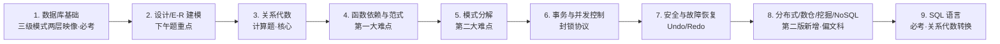

# 软考系统分析师 · 数据库章节学习路线

## 章节地图

## 考点价值表（活进度面板）

| 模块 | 考试形态 | 优先级 | 状态 |
|------|----------|--------|------|
| 数据库基础（三级模式两层映像） | 概念选择题 | ★★★ | ✅ 已学（3.1）· 待复习 |
| 数据库设计（5 阶段+产出物） | 概念选择题 | ★★ | ✅ 已学（3.1）· 待复习 |
| 数据模型（五类+三要素） | 概念选择题 | ★ | ✅ 已学（3.1） |
| E-R 建模（符号/联系/转换） | **下午题** | ★★★ | ✅ 已学（3.1）· 待复习 |
| 关系代数（连接家族/除法） | **计算题** | ★★★ | ✅ 已学（3.2/3.6）· 待复习 |
| 元组演算/域演算 | 概念选择题 | ★ | ✅ 已学（3.6） |
| 函数依赖与范式（1NF~4NF） | **计算/判定** | ★★★ | ✅ 已学（3.2/3.6）· 待复习 |
| 模式分解（无损/保持依赖） | **计算题** | ★★★ | ✅ 已学（3.3）· 待复习 |
| 事务与并发控制（ACID/封锁） | 概念题+锁相容 | ★★★ | ✅ 已学（3.3）· 待复习 |
| 安全与故障恢复 | 概念选择题 | ★★ | ✅ 已学（3.4/3.5）· 待复习 |
| 性能优化（含反规范化） | 概念选择题 | ★★ | ✅ 已学（3.4/3.5） |
| 分布式数据库 | 概念题（案例可考） | ★★ | ✅ 已学（3.4）· 待复习 |
| 数据仓库与 OLAP | 概念选择题 | ★★★ | ✅ 已学（3.4）· 待复习 |
| 数据挖掘 | 概念选择题 | ★★★ | ✅ 已学（3.4）· 待复习 |
| NoSQL / CAP / BASE | 概念选择题 | ★★★ | ✅ 已学（3.5）· 待复习 |
| SQL 语言 | **大题（关系代数转换）** | ★★★ | ✅ 已学（3.5）· 待复习 |

**下一步**：计算机网络与分布式系统章。操作系统章已摄入完毕 → [[wiki/syntheses/软考系统分析师-操作系统章节学习路线]]。

## 真题索引（从视频字幕中提取，14 道）

| 真题 | 考点 | 页面 |
|------|------|------|
| 视图/基本表/存储文件 ↔ 三级模式；独立性改哪层映像 | 三层映像 | [[wiki/concepts/数据库系统概述]] |
| 逻辑结构设计依据：需求说明书+数据字典+数据流图 | 设计阶段产出 | [[wiki/concepts/数据库设计]] |
| 教育管理：学生-课程 M:N；家长弱实体依赖学生 | E-R 联系/弱实体 | [[wiki/concepts/E-R模型]] |
| 部门-员工-项目：M:N → 独立关系模式，主键=员工代码+项目编号 | E-R 转关系 | [[wiki/concepts/E-R模型]] |
| R(ABCD)⋈S(CDE)：5 列；等价式 π_{1,2,3,4,7}(σ_{3=5∧4=6∧2>7}) | 自然连接↔笛卡尔积 | [[wiki/concepts/关系代数]] |
| U={A,B,C,D}, F={AB→C,CD→B}：候选键 ABD、ACD | 候选键求法 | [[wiki/concepts/函数依赖与范式]] |
| F={E→N,EM→Q,M→L}：候选键 EM，部分依赖 → 1NF | 范式判定 | [[wiki/concepts/函数依赖与范式]] |
| F={D→A,A→E,AC→B}；ρ={R1(ABCE),R2(CD)} 有损且不保持 | 模式分解综合 | [[wiki/concepts/模式分解]] |
| 事务更新提交前对其他事务不可见 = 隔离性 | ACID | [[wiki/concepts/事务与并发控制]] |
| 锁相容：S 后可加 S、X 后不能加任何锁（选 C） | 封锁协议 | [[wiki/concepts/事务与并发控制]] |
| 事务内容先写日志文件；缓冲区内容写数据库文件 | 故障恢复 | [[wiki/concepts/数据库安全与故障恢复]] |
| 数仓数据长期保留、很少修改删除 = 稳定 | 数仓特征 | [[wiki/concepts/数据仓库与OLAP]] |
| 零件 P：联合候选键 → 1NF；AVG/MAX-MIN；GROUP BY 零件号（A、D） | 范式+SQL 综合 | [[wiki/concepts/SQL语言]] |
| R(A..E)⋈S(B,C,F,G)：7 列；SELECT R.A,R.C,S.F,S.G；WHERE R.B=S.B AND R.C=S.C AND R.C<S.F（CADB） | 关系代数↔SQL | [[wiki/concepts/SQL语言]] |

## 复习指引

1. 先做「真题索引」14 题，遮答案自测
2. **考试趋势**：改版后偏文科、考教材原文——记忆型考点优先背原文表述（数仓四特征、挖掘 12 技术、故障恢复表、CAP/BASE、透明性）
3. 计算型优先（`mastery: 待复习`）：候选键求法→范式判定→模式分解一条链；关系代数↔SQL 互转；锁相容性
4. 图形考点：三级模式图、E-R 图、分布式四层架构、数仓四层体系、挖掘体系结构——课件原图已嵌入对应概念页
5. 已删除/低频：**大数据章节不再考**；4NF 偶尔会考、除法低频（2021 年考过一次）、元组演算了解即可
6. 口径备忘：设计阶段两说（规划 vs 实施运维）；透明性三种 vs 四种；SQL 优化 IN vs OR——以各页口径说明为准

## 相关页面

- 起点：[[wiki/entities/软考高级-系统分析师]] · [[wiki/skills/软考系统分析师备考流程]]
- 各模块概念页：[[wiki/concepts/数据库系统概述]] · [[wiki/concepts/数据库设计]] · [[wiki/concepts/数据模型]] · [[wiki/concepts/E-R模型]] · [[wiki/concepts/关系代数]] · [[wiki/concepts/元组演算与域演算]] · [[wiki/concepts/函数依赖与范式]] · [[wiki/concepts/模式分解]] · [[wiki/concepts/事务与并发控制]] · [[wiki/concepts/数据库安全与故障恢复]] · [[wiki/concepts/数据库性能优化]] · [[wiki/concepts/分布式数据库]] · [[wiki/concepts/数据仓库与OLAP]] · [[wiki/concepts/数据挖掘]] · [[wiki/concepts/NoSQL非关系数据库]] · [[wiki/concepts/SQL语言]]
- 来源：[[wiki/sources/课件总结-第三章]] · [[wiki/sources/3.1概述-三级模式-数据库设计-数据模型]] · [[wiki/sources/3.2关系代数-函数依赖-范式]] · [[wiki/sources/3.3模式分解-事务并发-封锁协议]] · [[wiki/sources/3.4安全-分布式-数据仓库-挖掘]] · [[wiki/sources/3.5非关系数据库-反规范化-SQL语言]] · [[wiki/sources/3.6补充一般连接-除法-元组演算-第4范式]]
