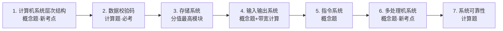

# 软考系统分析师 · 计算机系统章节学习路线

## 章节地图

## 考点价值表（活进度面板）

| 模块        | 考试形态          | 优先级 | 状态             |
| --------- | ------------- | --- | -------------- |
| 计算机系统层次结构 | 概念选择题         | ★★  | ✅ 已学（1.1）      |
| 数据校验码     | **计算题必考**     | ★★★ | ✅ 已学（1.1）· 待复习 |
| 存储系统      | 概念题 + **计算题** | ★★★ | ✅ 已学（1.2）· 待复习 |
| 输入输出系统    | 概念题 + 带宽计算    | ★★  | ✅ 已学（1.3）· 待复习 |
| 指令系统      | 概念选择题         | ★★  | ✅ 已学（1.3）      |
| 多处理机系统    | 概念选择题         | ★★  | ✅ 已学（1.3）      |
| 系统可靠性     | **计算题**       | ★★★ | ✅ 已学（1.3）· 待复习 |

**下一步**：计算机网络与分布式系统章。操作系统章、数据库章已摄入完毕 → [[wiki/syntheses/软考系统分析师-操作系统章节学习路线]] · [[wiki/syntheses/软考系统分析师-数据库章节学习路线]]。

## 真题索引（从视频字幕中提取）

| 真题 | 考点 | 页面 |
|------|------|------|
| CRC：1100, G=1011 → 010, 选A | 模2除法 | [[wiki/concepts/CRC循环冗余校验]] |
| 海明码：32位→6位校验位；D₅→P₄P₂ | 校验位位数/关系 | [[wiki/concepts/海明码]] |
| 磁盘调度：柱面21→23→17→571（选D） | 移臂+旋转调度 | [[wiki/concepts/磁盘存储]] |
| Cache 平均时间：90%命中→100.9ns | 命中率公式 | [[wiki/concepts/Cache高速缓存]] |
| 组相联：64块/4块组、4096页→19位 | 地址映像计算 | [[wiki/concepts/Cache高速缓存]] |
| Cache 冲突概率：直接>组相联>全相联 | 映像方式 | [[wiki/concepts/Cache高速缓存]] |
| 总线带宽：10MHz, 2时钟/周期, 4B→20MB/s | 带宽公式 | [[wiki/concepts/输入输出系统]] |
| Flynn：多核计算机属于MIMD | 体系分类 | [[wiki/concepts/多处理机系统]] |
| CISC 叙述正确：长度不固定（D） | CISC特征 | [[wiki/concepts/指令系统]] |
| 可靠性：0.9×0.96×x≥0.85→x≈0.984（A） | 混合串并联 | [[wiki/concepts/系统可靠性]] |

## 复习指引

1. 先做「真题索引」里的 10 题，遮答案自测
2. 计算题模块（CRC、海明码、Cache、磁盘调度、可靠性、总线带宽）优先——`mastery: 待复习`
3. 图形考点：分层结构图、磁盘物理结构、RAID 示意图、NAS/SAN、多处理机存储模型——**课件原图已嵌入对应概念页**；Cache 映像图、可靠性框图已 mermaid 补画
4. 已删除考点（数据表示、指令流水线计算）**不需要复习**

## 相关页面

- 起点：[[wiki/entities/软考高级-系统分析师]] · [[wiki/skills/软考系统分析师备考流程]]
- 各模块概念页：[[wiki/concepts/计算机系统层次结构]] · [[wiki/concepts/校验码]] · [[wiki/concepts/存储系统]] · [[wiki/concepts/输入输出系统]] · [[wiki/concepts/指令系统]] · [[wiki/concepts/多处理机系统]] · [[wiki/concepts/系统可靠性]]
